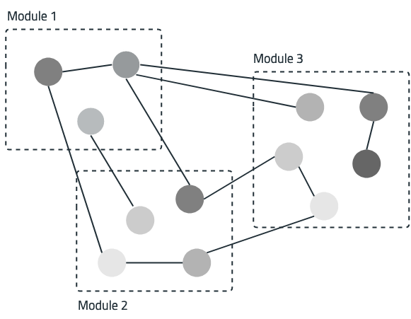
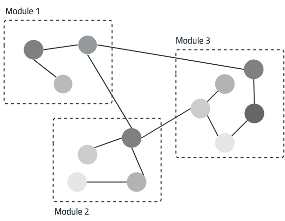
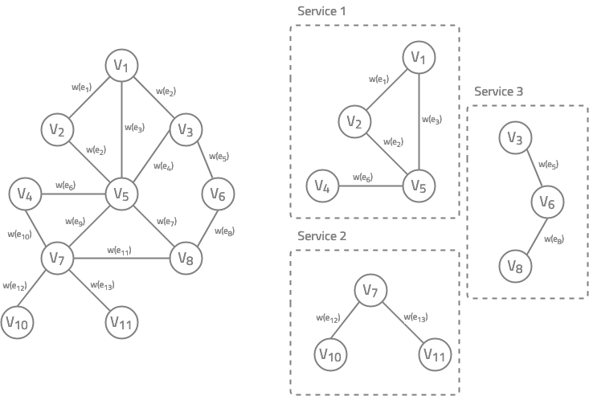

# Graph-based decomposition of monolithic architectures - a path to microservice architectures

## Idea

This [project](https://github.com/gmazlami/microserviceExtraction-backend) was originally implemented by Genc Mazlami in the 
scope of a master thesis at the Department of Informatics at the University of Zurich.

As mentioned in the [README.md](https://github.com/gmazlami/microserviceExtraction-backend/blob/master/README.md) of the original 
project, further modifications can be done for academic purposes - as it applies in this case.
````
Any further use, modificaion or copy is allowed solely for academic purposes. All rights belong to Genc Mazlami.
````

## About the implementation

### Coupling and cohesion
Software systems are composed of functionalities that are located in different self-contained units such as modules,
packages or components, depending on the abstraction level. In this respect, a differentiation is made between coupling
and cohesion. In the case of dependencies across functional units, the term coupling is used. For dependencies
within a unit, it is called cohesion. Therefore it applies that each software system should aim for an architecture
with a low degree of coupling and a high degree of cohesion. In other words, the functionalities that belong together
are grouped together in an abstraction unit and have clear interfaces. The visualizations below illustrate
a bad example in `a.)` and a good interplay of coupling and cohesion in `b.)`.
#### a.)

#### b.)


### Graph-based clustering
Software architectures can be represented as a weighted, undirected graph based on artefacts such as the
source code and the versioning system backing it. The graph vertices represent atomar functional units.
The weight of edges express the degree of coupling between these units. Part left graph below illustrates
a monolithic system with vertices `V_1` to `V_11` and edges `e_1` to `e_13`. The graph can be
composed of different coupling strategies. The weights `w(e_1)` to `w(e_13)` therefore indicate the degree of coupling
between atomar units. The coupling strategy defines the method by which the weight of the edges is calculated.
Methods described by **Genc Mazlami, Jürgen Cito and Philipp Leitner** are `logical coupling`,
`semantic coupling` and `contributor coupling`. A combination of several coupling strategies with the 
same or different weighting factors is also possible.



Now that a graph (left side) has been built from existing artifacts, the decomposition into services can be performed.
Decomposition in terms of a graph implies the deletion of edges. To ensure, that each deletion
causes a partition, only those edges which are included in the minimum spanning tree are considered.
The idea is to keep those atomar units in the same service `(cluster)` which have the highest coupling `(weight)`.
The right part in the visualization above shows how the output of the clustering algorithm can look like.

Reference: https://ieeexplore.ieee.org/abstract/document/8029803

## API
The application exposes three resources:
- [Repository](./src/main/java/monolith2microservice/inbound/RepositoryController.java)
- [Decomposition](./src/main/java/monolith2microservice/inbound/DecompositionController.java)
- [Evaluation](./src/main/java/monolith2microservice/inbound/EvaluationController.java)

## How to start
As data persistence, a postgres database is used. To get started, you have to execute the following command:
````SHELL
docker run \
    --name graph-based-decomposition-db \
    -e POSTGRES_PASSWORD=<insert password> \
    -e POSTGRES_USER=<insert user> \
    -p 5432:5432 \
    -d postgres:latest
````
After starting the project as spring boot application the Swagger documentation can be found [here](http://localhost:8080/swagger-ui.html).

## Visualization
The functionality provided via the REST API was used to implement a web application. The [frontend project](https://github.com/michael-neuhold/graphbased-decomposition-frontend)
wasa developed to provide a better usability for decomposing and analyzing results. 

